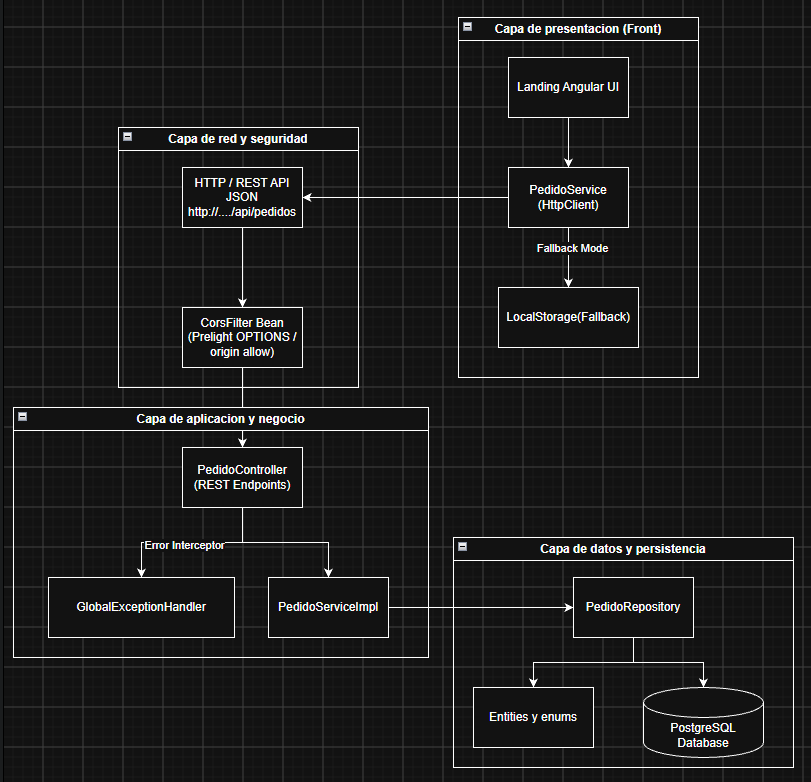

# FN-Pedidos - Aplicación Full Stack (Spring Boot + Angular + PostgreSQL)

Sistema de gestión de pedidos desarrollado con **Spring Boot (Java 17 / Gradle)** en el Backend, **Angular 19+** en el Frontend y **PostgreSQL** desplegado mediante **Docker**.

---

## 🛠️ Prerrequisitos

Asegúrate de contar con los siguientes componentes instalados en tu sistema:

- **Docker** y **Docker Compose**
- **Java JDK 17** (o superior)
- **Node.js** (v18+) y **npm** (o Angular CLI)

---

## 🚀 Pasos para Ejecutar la Aplicación en Localhost

### 1. Iniciar la Base de Datos PostgreSQL (Docker)

Abre una terminal en la raíz del proyecto ([`e:\dev\springboot\FN-pedidos`](file:///e:/dev/springboot/FN-pedidos)) y ejecuta:

```bash
docker compose up -d
```

> **Verificación:** Puedes confirmar que el contenedor está corriendo ejecutando `docker ps`. La base de datos estará disponible en `localhost:5432` con la base de datos `fn_pedidos_db`.

---

### 2. Iniciar el Backend (Spring Boot con Gradle)

Navega a la carpeta [`backend`](file:///e:/dev/springboot/FN-pedidos/backend) y ejecuta el servidor de desarrollo:

#### En Windows (PowerShell / CMD):
```cmd
cd backend
gradlew.bat bootRun
```

#### En Linux / macOS:
```bash
cd backend
./gradlew bootRun
```

> **Backend listo:** El servidor iniciará en `http://localhost:8080`.
> Puedes probar la salud del servicio ingresando a: `http://localhost:8080/api/health`

---

### 3. Iniciar el Frontend (Angular)

En otra ventana de terminal, navega a la carpeta [`frontend`](file:///e:/dev/springboot/FN-pedidos/frontend) y ejecuta:

```bash
cd frontend
npm start
```

*(Alternativamente puedes usar `npx ng serve`)*

> **Frontend listo:** La aplicación web estará disponible en tu navegador en:
> **`http://localhost:4200`**

---

## 📌 Resumen de Rutas y Servicios

| Componente | Dirección URL | Descripción |
| :--- | :--- | :--- |
| **Frontend Angular** | `http://localhost:4200` | Interfaz de usuario web |
| **API Backend REST** | `http://localhost:8080/api/pedidos` | Endpoints REST de la gestión de pedidos |
| **Health Check API** | `http://localhost:8080/api/health` | Estado del servicio backend |
| **Base de Datos** | `localhost:5432` | PostgreSQL (usuario: `postgres`, db: `fn_pedidos_db`) |

---

## 📁 Estructura del Proyecto

```
FN-pedidos/
├── docker-compose.yml          # Despliegue del contenedor PostgreSQL
├── README.md                   # Guía de ejecución del proyecto
│
├── backend/                    # Proyecto Java Spring Boot (Gradle)
│   ├── build.gradle            # Dependencias (Spring Data JPA, PostgreSQL, Lombok, Web)
│   └── src/main/java/com/pedidos/backend/
│       ├── domain/enums/       # EstadoPedido, TipoItem
│       ├── entity/             # PedidoEntity, ItemPedidoEntity (Persistencia JPA)
│       ├── dto/                # Request y Response DTOs
│       ├── repository/         # PedidoRepository (Spring Data JPA)
│       ├── service/            # PedidoService y PedidoServiceImpl (Lógica de negocio)
│       └── controller/         # PedidoController (/api/pedidos)
│
└── frontend/                   # Proyecto Angular (Standalone)
    └── src/app/
        ├── models/             # Interfaces TypeScript (Pedido, ItemPedido, etc.)
        ├── services/           # PedidoService (Integración HTTP)
        ├── components/         # Componentes UI reutilizables
        ├── pages/              # Vistas principales
        ├── guards/             # Guardias de navegación
        └── interceptors/       # Interceptores HTTP
```

## Diagrama de Arquitectura



